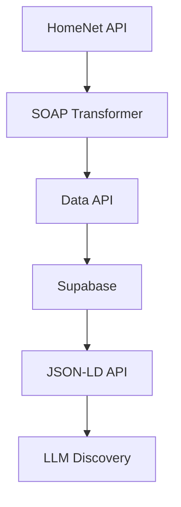

# Architecture Diagrams

This directory contains visual diagrams and flowcharts for the Open Dealer platform architecture.

## Diagrams to Create

### 1. System Architecture Diagram
- **File**: `system-architecture.png`
- **Purpose**: High-level system overview showing all components
- **Tools**: Draw.io, Lucidchart, or Mermaid
- **Content**: Data flow from ingestion to LLM discovery

### 2. Data Flow Diagram
- **File**: `data-flow.png`
- **Purpose**: Detailed data processing pipeline
- **Content**: HomeNet → SOAP Transformer → Data API → Supabase → JSON-LD → LLM

### 3. Deployment Architecture
- **File**: `deployment-architecture.png`
- **Purpose**: Infrastructure and deployment overview
- **Content**: Vercel, Digital Ocean, Supabase, Apify components

### 4. API Integration Flow
- **File**: `api-integration.png`
- **Purpose**: API endpoints and integration points
- **Content**: REST API, JSON-LD, Sitemap endpoints

### 5. Database Schema Diagram
- **File**: `database-schema.png`
- **Purpose**: Database structure and relationships
- **Content**: Vehicles table, indexes, relationships

## Diagram Guidelines

### Format
- **Primary**: PNG format for web viewing
- **Source**: Include editable source files (Draw.io XML, Lucidchart, etc.)
- **Resolution**: Minimum 1920x1080 for clarity

### Style
- **Colors**: Use consistent color scheme
- **Fonts**: Sans-serif fonts (Arial, Helvetica, etc.)
- **Icons**: Use standard technology icons
- **Labels**: Clear, descriptive labels

### Content
- **Components**: Show all major system components
- **Data Flow**: Indicate data direction and format
- **Technologies**: Label specific technologies used
- **Interfaces**: Show API endpoints and protocols

## Tools for Creating Diagrams

### Recommended Tools
1. **Draw.io** (diagrams.net) - Free, web-based
2. **Lucidchart** - Professional, collaborative
3. **Mermaid** - Code-based diagrams
4. **Figma** - Design-focused
5. **Visio** - Microsoft ecosystem

### Mermaid Example

## File Naming Convention
- Use kebab-case: `system-architecture.png`
- Include version: `system-architecture-v1.png`
- Include date: `system-architecture-2025-01.png`

## Maintenance
- Update diagrams when architecture changes
- Version control all diagram files
- Include diagrams in documentation updates
- Review diagrams quarterly for accuracy

---

*Create these diagrams to provide visual clarity for stakeholders and technical documentation.*
